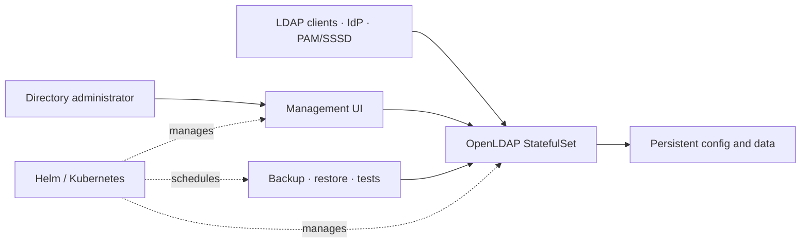
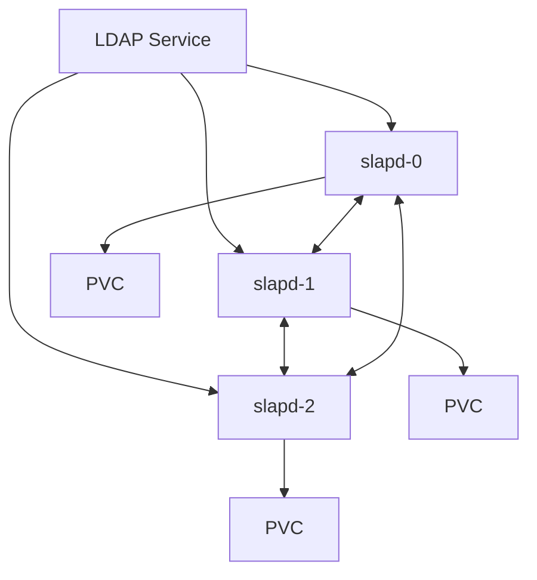

# Architecture

ldapium packages a current OpenLDAP server, an optional management UI and a Helm chart. The LDAP directory remains the system of record; the UI and operational jobs use normal LDAP interfaces rather than maintaining a second identity database.

## System context

## Runtime components

| Component | Source | Responsibility |
|---|---|---|
| Server image | `image/` | OpenLDAP built from upstream source, overlays, TLS and startup validation |
| UI backend | `ui/backend/` | LDAP-bind authentication, directory operations and optional OIDC integration |
| UI frontend | `ui/frontend/` | DIT browsing and user/group administration |
| Helm chart | `charts/ldapium/` | StatefulSet, Services, Secrets, storage, replication, UI and backup jobs |
| Operations | `scripts/` | Backup, restore, air-gap packaging, verification and compatibility tests |

## High-availability profile

With one replica, replication is disabled. With multiple replicas, each pod has persistent data and participates in N-way multi-provider replication. The service offers a stable client endpoint, while strict TLS identity checks protect peer and client connections. Detailed failure assumptions are in the [HA profile](ha-profile.md).

## Identity and trust boundaries

- No default directory password or UI session secret is embedded.
- LDAP-bind is the default administrator authentication path.
- Optional Keycloak login is role-gated and uses a dedicated LDAP service account.
- TLS material is supplied by Secret and requires a rolling restart after renewal.
- Encryption at rest belongs to the storage/platform boundary; see [encryption at rest](encryption-at-rest.md).

## Deployment profiles

The same server and UI images run under Helm or Docker Compose. Kubernetes adds StatefulSet identity, persistent volumes, health probes, automated replication wiring and CronJob backups. Compose provides a single-node development or standalone profile; it does not emulate Kubernetes HA or scheduling behavior.

