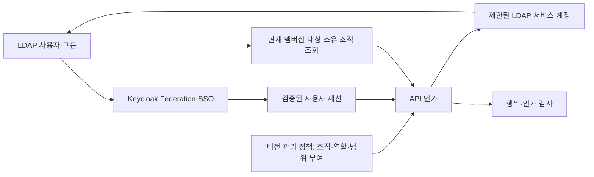

# Change: LDAP–Keycloak 사용자·그룹·조직 범위 인가 연동 설계

- Change class: `D` — 인증·인가 경계 및 API 접근 의미 변경
- Owner: 미지정 — 구현 착수 전 지정
- Related issue: 미등록
- Status: `Implementing` — first metadata slice only
- Accepted by / date: 사용자 “구현 시작해”, 2026-10-01 — D15/D16 첫 구현 단계
- 작성일: 2026-10-01

> 범위 확장: 사용자 요청에 따라 UI 정책 편집, 외부 OSS API, 제한된 Keycloak 관리까지
> 포함한다. [CONTROL-PLANE.md](CONTROL-PLANE.md)가 아래 초기 정적 카탈로그 제안의
> D1 저장소, D3 역할 원본, D5 정책 원본, D6 변경 경로와 Non-goals를 대체한다.
> 조직/역할 분리, Grant 단위 평가와 보호 그룹 원칙은 유지한다. Status는 Draft다.
> OSS별 연동 범위는 [추가 계획](OSS-PERMISSION-INTEGRATION.md)의 REQ-017–025,
> AC-021–029와 앱별 적용 단계까지 포함한다.
> 최신 판단: [범용 프로파일·Keycloak 책임](APP-AUTHORITY-AND-CAPABILITIES.md)의 D15/D16이
> 역할 DB 원본/자동 투영과 고정 OSS rollout 제안을 대체한다. 역할 원본은 Keycloak,
> LDAPium은 기본 조회·명시적 위임 UI이며 외부 중앙 check는 선택 기능이다.

## Problem

현재 SSO는 `SSO_ADMIN_ROLE`(기본 `ldap-admin`)을 ID token의 `roles` 또는
`realm_access.roles`에서 확인하고, `preferred_username`으로 LDAP 사용자를 찾는다.
실제 LDAP 작업은 서비스 계정으로 수행한다. 조직별 접근 범위와 작업별 역할은
현재 문서화된 계약에 포함되지 않는다. 근거: [UI SSO](../../../ui/README.md#keycloak-sso),
[로그인 구현](../../../ui/backend/internal/httpapi/sso.go).

상위 관리자가 하위 조직을 관리하면서도 다른 조직에는 접근하지 못하게 하려면
사용자 소속, 역할 포함 관계, 관리 범위를 분리해야 한다. 이 문서는 제안 설계이며
기존 동작 변경이나 런타임 검증 완료를 의미하지 않는다.

## Intent

LDAP을 사용자·그룹 멤버십 원본으로 유지하고 Keycloak으로 SSO와 역할 조합을
제공한다. 애플리케이션은 매 요청마다 행위와 대상 조직 범위를 함께 검사한다.
상위 역할은 연결된 하위 역할의 권한을 포함하고, 상위 조직에 대한 subtree 권한은
하위 조직에 적용한다. 상위 조직 일반 구성원에게 관리자 권한을 자동 부여하지 않는다.

## Scope

- 사용자 식별, 그룹 동기화, 역할 계층, 조직 모델, 범위 부여, API/UI 인가 설계.
- 회수·감사·서비스 계정 경계, 단계적 전환, 수용 시나리오 및 후속 작업.
- 대상: SSO 사용자, 조직 관리자, 플랫폼 관리자, 운영자와 연동 애플리케이션.

## Non-goals

- 이번 작업은 설계 문서 작성이다. 코드·LDAP 스키마·ACL·배포 설정은 변경하지 않는다.
- 범용 IGA/SCIM/다중 디렉터리 동기화 엔진, 승인 워크플로, 새 외부 인가 제품 도입.
- OIDC 역할을 OpenLDAP ACL로 자동 변환하거나 rootdn을 UI 서비스 계정으로 사용.
- 기존 LDAP 직접 로그인에 이 모델을 묵시적으로 적용.

## Requirements

- `REQ-001` — 사용자 식별은 `(iss, sub)`로, LDAP 연결은 불변 UUID로 수행한다.
- `REQ-002` — LDAP 그룹을 원본으로 사용하고 동기화·삭제·이름 변경을 추적한다.
- `REQ-003` — 역할 계층은 상위 역할의 하위 권한 포함 관계로 정의한다.
- `REQ-004` — 모든 부여는 역할·조직·범위를 함께 보존하며 조직 간 누출을 막는다.
- `REQ-005` — 모든 API 경로에서 행위·속성·대상 범위를 검사한다.
- `REQ-006` — 권한 부여·조직 변경·멤버십 변경 자체를 특권 작업으로 보호한다.
- `REQ-007` — 회수 지연을 제한하고 판단 근거와 실제 행위를 감사 가능하게 한다.
- `REQ-008` — 기존 계약을 유지하며 명시적 전환과 fail-closed 운영을 제공한다.

## Architecture and decisions

### D1 — 사용자 소속과 역할, 조직 범위를 분리

이유: 조직 트리가 권한 트리는 아니다. 비용: 별도 조직 카탈로그와 범위 매핑이 필요하다.
대안/탈출 경로: 조직별 모델이 불필요한 배포는 기존 전체 관리자 모드를 유지한다.



| 모델 | 식별/필드 | 원본과 책임 |
|---|---|---|
| User | `(issuer, subject)`, LDAP `entryUUID`, enabled | LDAP 계정, Keycloak OIDC 식별; UI는 대응 검증 |
| Group | LDAP `entryUUID`, `cn`, `member` | LDAP; DN·그룹 이름은 변경 가능한 표시/조회 정보 |
| Organization | `org_id`, `parent_org_id`, 표시 이름 | 배포 정책 카탈로그; 단일 부모·순환 금지 |
| ResourceOwnership | 종류, 불변 ID, `org_id` | 사용자·그룹은 정책 카탈로그의 UUID 매핑 |
| Role | role ID, 허용 행위, 포함 역할 | Keycloak Composite + 애플리케이션의 행위 정의 |
| Grant | group UUID, role ID, org ID, `self/subtree`, enabled | 버전 관리 배포 정책; 보안 운영자만 변경 |

카탈로그는 버전 관리되는 배포 파일을 읽는 초기 구성을 선택한다. 신규 DB를 추가하지
않으며 정책 파일과 UUID 매핑 변경을 재배포로 적용한다. 자원 생성 시 조직 매핑도
먼저 예약된 UUID/워크플로로 확정해야 한다. 따라서 초기 scoped 모드에서는
일반 CRUD에 의한 사용자·그룹 신규 생성과 조직 이동을 차단하고 보안 운영자의
프로비저닝 절차로만 처리한다. 예약 UUID의 구현 방식은 구현 패키지에서 결정한다.
미매핑 자원은 scoped 사용자에게 거부하며, 무제한 플랫폼 관리자만 정리할 수 있다.
일반 UI에서 즉시 생성·이동이 필요해지면 원자적 소유권 저장을 위한 별도 설계가 필요하다.

조직 트리는 LDAP DIT/OU나 Keycloak 그룹 경로에서 자동 추론하지 않는다.
다중 소속은 허용하지만 관리 자원의 소유 조직은 하나다. 공유가 필요하면 별도
명시적 부여로 처리하며 어느 조직에 속했는지에 따라 권한을 임의 합성하지 않는다.

### D2 — 조직 그룹과 권한 부여 그룹은 분리하고 평면 동기화

이유: Keycloak 하위 그룹은 부모 역할을 상속하므로 상위 관리자 역할 배치가
하위 직원에게 권한을 노출할 수 있다. 비용: 그룹 이름 규칙과 매핑 관리가 필요하다.
탈출 경로: 단일 부모 계층을 확실히 검증한 일반 소속 그룹만 계층 보존을 별도 허용한다.

```text
LDAP ou=groups
  org-engineering-members     # 일반 소속; 관리자 권한 없음
  org-platform-members        # 일반 소속; 관리자 권한 없음
  access-engineering-admins   # engineering subtree 관리자 부여
  access-platform-readers     # platform self 조회 부여
  access-service-operators    # service subtree 운영자 부여
```

- LDAP `groupOfNames`, `cn`, `member`(DN)를 기본 프로파일로 사용한다.
- Keycloak LDAP provider Edit Mode와 Group Mapper는 READ_ONLY를 시작점으로 한다.
- Group Mapper의 Preserve Group Inheritance는 OFF; 권한 그룹은 직접 사용자 멤버만
  허용한다. 간접 멤버십은 지원하지 않는 초기 계약으로 명시한다.
- Group Mapper READ_ONLY는 로컬 DB 멤버십과 합칠 수 있으므로 Keycloak 그룹 claim을
  최종 범위 근거로 사용하지 않는다. API가 LDAP의 현재 직접 멤버십을 확인한다.
- 불변 `entryUUID`를 읽을 수 있는 최소 LDAP ACL을 확인한다. LDAP UUID와
  Keycloak 그룹 ID는 다른 값이며 이름/경로만으로 매핑하지 않는다.
- 사용자·그룹 rename은 UUID 연결을 유지한다. 삭제 후 동일 이름 재생성은 새 UUID로
  취급하여 이전 Grant를 자동 승계하지 않는다. 그룹 삭제 동기화도 명시적으로 운영한다.
- `memberOf`는 조회 최적화 후보이나 중첩·회수 의미를 별도 검증하기 전 채택하지 않는다.
- empty-membership-placeholder는 사용자/권한 부여 대상에서 제외한다.

### D3 — 상위 역할은 하위 역할의 권한을 포함

이유: 계층형 RBAC 요구를 Composite Role로 구현한다. 비용: 역할 정의와 정책 매핑의
일치 검증이 필요하다. 탈출 경로: 복잡해지면 역할을 평면 권한 묶음으로 재구성한다.

```text
directory-reader: user.read, group.read
directory-operator: directory-reader + user.profile.update
directory-org-admin: directory-operator + group.membership.manage
directory-platform-admin: 조직 범위 밖 운영·정책 관리를 포함하는 별도 특권 역할
```

정의된 상위 역할의 유효 행위는 자체 행위와 포함 역할 유효 행위의 합집합이다.
자동 포함 대상은 연결된 하위 역할이며 새 역할을 만드는 것만으로 포함되지 않는다.
순환을 거부한다. 초기 역할은 Client Role(`ldapium-ui`)로 정의한다.
기존 realm role `ldap-admin`은 legacy 모드에서만 전체 관리자 의미를 유지한다.

`user.password.reset`, `user.unlock`, 사용자 삭제, 조직 이동, 범용 DIT 쓰기와
권한 그룹 변경은 일반 org-admin에 자동 포함하지 않는다. 필요하면 별도 허용
행위를 명시한 역할로 추가한다. 이것은 역할 계층 자체의 예외가 아니라 역할 정의다.
role ID는 API 행위의 이름과 같을 필요가 없으며 행위는 앱에서 정의·검사한다.

### D4 — 역할과 범위를 결합한 Grant 단위로 판단

이유: A 조직 관리자와 B 조직 조회자 권한의 교차 합성 방지. 비용: 각 Grant를 개별
평가한다. 탈출 경로: 규모가 커질 때 외부 인가 서비스를 검토하되 현재 도입하지 않는다.

```yaml
# 제안 정책 형식; 실행 가능한 현재 설정이 아니다.
version: 1
organizations:
  - {id: engineering, parent: null}
  - {id: platform, parent: engineering}
  - {id: service, parent: engineering}
grants:
  - {group_uuid: "<engineering-admins UUID>", role: directory-org-admin,
     org: engineering, scope: subtree}
  - {group_uuid: "<platform-readers UUID>", role: directory-reader,
     org: platform, scope: self}
```

```text
allow(user, action, resource) :=
  identity_is_active(user)
  AND resource_has_trusted_owner(resource)
  AND EXISTS grant:
      user_is_current_direct_member(user, grant.group_uuid)
      AND action IN expanded_permissions(grant.role)
      AND resource.org IN allowed_scope(grant.org, grant.scope)
  AND operation_specific_constraints_hold
```

同一 Grant 내에서 역할과 범위가 모두 만족해야 한다. `roles × orgs`의 곱으로 평가하지
않는다. `self`는 해당 조직만, `subtree`는 해당 조직과 현재 자손 조직을 의미한다.
예: engineering 관리자 → platform/service 관리 허용; platform 관리자 →
engineering 및 service 접근 거부. 일반 engineering 구성원 → 관리자 권한 없음.
역할은 무엇을 할 수 있는지, 조직 범위는 어디에서 할 수 있는지를 결정한다.

### D5 — 정책과 현재 멤버십을 API에서 검사

이유: UI 숨김과 로그인 역할 검사로는 서비스 계정의 LDAP 권한을 제한할 수 없다.
비용: 요청별 멤버십/소유권 조회와 감사가 필요하다. 탈출 경로: 성능 검증 후 회수
기한을 보존하는 버전 기반 캐시를 별도 설계한다.

- 기존 browser Authorization Code + PKCE, nonce, 서버 세션 방식을 유지한다.
  ID token은 로그인 검증에 사용하고 API bearer token으로 재사용하지 않는다.
- 제안 scoped 모드는 검증된 `(iss, sub)`와 LDAP UUID 대응을 세션에 보관한다.
  최초 연결은 기존 username 검색과 관리자가 지정한 UUID 대응으로 확인하고,
  연결 이후 username 변경/재사용만으로 다른 UUID에 재연결하지 않는다.
  장기 대응 저장 위치는 배포 정책 카탈로그다. 연결 누락·중복이면 로그인 거부한다.
- OIDC claim의 Client Role은 클라이언트 전용으로 노출·검증하되 최종 조직 권한은
  서버 정책 Grant로 판단한다. 서로 다른 역할 원본을 합쳐 권한을 확장하지 않는다.
  scoped 모드에서 Keycloak 역할은 앱 진입 자격, Grant는 작업 인가 원본이다.
- 사용자 enabled/존재 및 권한 그룹 직접 멤버십은 LDAP에서 매 요청 확인한다.
  비활성 판단 속성과 Keycloak 연결 해제 감지는 실제 배포 프로파일에서 확정·검증한다.
- 대상은 서버에서 UUID와 조직을 해석한다. 요청의 org ID, group path, DN을 신뢰하지
  않는다. DN 처리는 LDAP 서비스 계층에 남기고 문자열 suffix 비교로 범위를 판정하지 않는다.
- 목록·검색·트리·상세·export·count·autocomplete를 모두 범위 제한한다. 검색 후
  화면에서만 숨기지 않는다. 목록 쿼리 계획은 허용 UUID 범위를 LDAP 필터에 반영하며,
  비허용 자원의 존재·전체 개수·페이지 정보가 드러나지 않도록 검사한다.
- 쓰기는 즉시 재검사하며 허용 속성만 변경한다. entryUUID, 권한 연결 속성, 민감
  속성은 일반 프로필 수정에서 제외한다. 범용 DIT 수정은 scoped 모드에서 차단한다.
- bulk는 전체 대상 사전 검사 후 하나라도 비허용이면 전체 요청 거부한다. LDAP 다중
  작업의 원자성은 보장하지 않으며 중간 실패 시 결과와 복구 대상을 기록한다.
- 조직 이동/rename, 멤버 추가·삭제, password reset, unlock는 전용 행위로 검사한다.
  그룹 멤버 추가는 그룹과 사용자 양쪽 조직 범위가 모두 허용되어야 한다.
- 인가/정책 조회 실패는 거부한다. UI는 `/api/me`의 서버 계산 capability로 표시하되
  API 검사를 대체하지 않는다. 외부 API Access Token 지원은 별도 계약으로 남긴다.

### D6 — 권한 정책 변경은 일반 조직 관리에서 분리

이유: 관리자가 자신을 access 그룹에 가입시키면 상위 특권을 획득한다.
비용: 조직 일반 그룹과 권한 그룹의 구분을 정책에 기록한다.
탈출 경로: 승인/위임 제품은 외부에서 연결하되 핵심 API에는 최소 권한 검사를 남긴다.

권한 부여 그룹은 보호 대상으로 등록한다. membership 관리, 삭제, rename, 직접 DIT
수정, 복제/가져오기 모두 동일 보호를 적용한다. 일반 조직 관리자는 자신의 관리 범위
안이라도 보호 그룹을 수정할 수 없다. Grant·역할 정의·조직 parent·소유권 변경은
플랫폼 보안 운영자만 수행하며 정책 diff와 영향 받는 조직을 기록한다.
조직 재배치는 상위 관리자의 접근 범위를 바꾸므로 단순 표시 변경으로 취급하지 않는다.

### D7 — 회수 목표와 실제 LDAP 권한을 분리

이유: 기존 JWT/세션과 LDAP 연결의 수명이 다르다. 비용: 온라인 조회 및 세션 검증.
탈출 경로: 장애 시 접근 허용 대신 legacy 전환을 운영자가 명시적으로 결정한다.

- LDAP 멤버십 제거/계정 삭제: 변경이 조회 서버에 반영된 뒤 시작하는 요청은 거부한다.
  다중 provider 복제 지연은 별도 측정하며 초기 회수 목표는 60초 이내로 제안한다.
- 정책 변경: 모든 UI 인스턴스의 새 정책 버전 활성화 후 다음 요청부터 반영한다.
  부분 반영이 발생하면 scoped 쓰기를 중지한다. 로딩 실패는 이전 정책으로 무기한
  운영하지 않고 rollout 실패로 처리한다.
- Keycloak 계정 비활성/SSO 강제 로그아웃: 로컬 세션만으로 즉시 감지되지 않는다.
  초기에는 로컬 SSO 세션 최대 5분 및 재로그인 시 자격 재검증을 제안한다. 따라서
  Keycloak 전용 회수 목표는 최대 5분이다. 60초 긴급 회수에는 LDAP 멤버십 회수와
  로컬 세션 무효화를 함께 수행한다. session expiry 강제 검증은 후속 구현 대상이다.
- 이미 실행된 LDAP 요청을 취소하거나 분산 원자성을 보장하지 않는다. 쓰기 직전
  재검사와 변경 로그로 잔여 경쟁 구간을 제한한다.
- Keycloak federation 계정(조회)과 UI 계정(필요한 쓰기)을 분리한다. rootdn 금지,
  TLS hostname 검증, 허용 subtree/속성 ACL과 HTTP `userPassword` denylist를 유지한다.
- OpenLDAP는 서비스 계정을 actor로 보므로 API 감사에는 issuer/sub, 사용자 UUID,
  대상 UUID/조직, action, Grant/정책 버전, allow/deny, request ID, 실제 LDAP 결과를
  기록한다. 비밀번호·토큰은 기록하지 않으며 LDAP 로그와 request ID/시간으로 연결한다.
- 직접 LDAP 클라이언트는 별도 ACL 정책이다. OIDC 역할과 동일한 효과를 보장한다고
  주장하지 않는다. 관리자 LDAP 직접 쓰기로 정책 보호가 우회될 수 있음을 운영 경계에 명시한다.

## Acceptance scenarios

| ID | Covers | Given / When | Then |
|---|---|---|---|
| AC-001 | REQ-001 | username rename 또는 동일 이름 계정 재생성 후 로그인 | UUID 유지 시 연결 유지; 새 UUID 자동 연결 거부 |
| AC-002 | REQ-002 | 권한 그룹 rename/delete 또는 Keycloak 로컬 가입 | rename 연결 유지; 삭제/로컬 가입만으로 권한 유지 불가 |
| AC-003 | REQ-003 | admin Composite에 operator 포함 | admin은 read/write 획득; reader는 write 거부 |
| AC-004 | REQ-004 | engineering subtree 관리자, platform 대상 작업 | 허용; platform 관리자의 engineering/service 접근 거부 |
| AC-005 | REQ-004 | A 관리자 + B 조회자에게 B 수정 요청 | 거부; A 수정/B 조회는 허용 |
| AC-006 | REQ-005 | 비허용 UUID/DN을 상세·검색·export·bulk에 전달 | 거부/범위 제한; 개수·페이지 정보 누출 없음 |
| AC-007 | REQ-006 | org-admin이 access 그룹에 자신을 추가/DIT 변경 | 거부; 일반 그룹의 범위 내 멤버십만 허용 |
| AC-008 | REQ-006 | 조직을 다른 부모로 이동하거나 미매핑 자원 생성 | 일반 사용자 거부; 보안 운영자 변경 영향 기록 |
| AC-009 | REQ-007 | LDAP 멤버 제거/계정 삭제, KC disable | 각 회수 목표 측정; 기존 세션의 접근도 기한 내 거부 |
| AC-010 | REQ-007 | 서비스 계정으로 LDAP 수정 성공/실패 | 사용자별 API 감사와 실제 LDAP 결과 연결; 비밀 노출 없음 |
| AC-011 | REQ-008 | LDAP/정책 조회 장애 또는 정책 부분 rollout | fail-closed; scoped 쓰기 중지; legacy 자동 fallback 없음 |
| AC-012 | REQ-005, REQ-008 | UI 버튼 우회 요청 및 legacy 로그인 회귀 | API 검사 유지; 선택한 legacy 계약만 그대로 유지 |

## Change impact

| Area | Impact / evidence needed |
|---|---|
| Source / API / command | 향후 SSO/session, 중앙 인가, 전체 handler와 LDAP query/service, capabilities |
| Dependencies / lockfiles | 이번 설계 변경 없음; 신규 인가 제품/DB 기본 도입 없음 |
| Runtime / toolchain | 이번 변경 없음; 향후 정책 카탈로그 로더/세션 기한 구현 |
| CI / CD | 향후 실제 LDAP·Keycloak 조직 인가 E2E 추가 |
| Release / packaging | 향후 정책 파일 mount, scoped 모드 옵션과 Secret 분리 |
| Generated output | N/A — 문서만 추가 |
| Security / supply chain | 특권 경계 확대가 아니라 세분화이나 서비스 계정 우회 위험 검증 필수 |
| Offline / air-gap | 배포 정책·LDAP·기존 Keycloak만 사용; 외부 온라인 인가 의존 없음 |
| Documentation / operations | 향후 UI README, auth policy, product boundary, audit schema 갱신 |
| Portfolio / downstream | Draft로 유지; 기능 지원 상태를 올리지 않음 |

ADR threshold: required — 인가 경계 변경. 패키지 수용 후 D1–D7을 ADR에 확정한다.
정적 Composite만 사용하는 대안은 조직별 역할 폭증/회수 관리 비용 때문에 범위 모델을
대체하지 못한다. 외부 OpenFGA는 규모·관계 복잡도가 증가할 때 비교할 후속 대안이다.

## Verification plan

| Acceptance ID | Method | Environment / expected evidence |
|---|---|---|
| AC-001–002 | LDAP/KC rename·삭제·로컬 가입 재현 | disposable LDAP+repo pinned Keycloak; UUID·세션 결과 |
| AC-003–005 | pure policy helper unit + 실제 토큰/HTTP | 역할 확장·범위·교차 합성 negative 결과 |
| AC-006–008 | 전체 endpoint inventory + HTTP negative E2E | LDAP 전후 상태·응답·count·bulk 결과 |
| AC-009–011 | 기존 로그인 세션 유지하며 회수/장애 실험 | 시간 측정, 복제 지연, 모든 UI 인스턴스 결과 |
| AC-010 | API/LDAP 감사 상관관계 검사 | 비밀 없는 로그, 성공·실패 양쪽 기록 |
| AC-012 | 브라우저 UI + 직접 HTTP + legacy 회귀 | 화면 렌더링·버튼 우회 거부·기존 모드 결과 |

wire 경로는 mock으로 대체하지 않는다. 현 저장소 Keycloak pin으로 먼저 검증하며
latest 문서의 기능을 해당 버전에서 지원한다고 가정하지 않는다.

## Rollout, rollback and recovery

1. 패키지 수용·ADR 확정, API 전체 inventory와 기존 full-admin 기준선 확보.
2. 테스트 환경에서 정책 카탈로그/UUID 연결 검증; legacy와 scoped 모드를 명시적으로 분리.
3. shadow 판단을 기존 관리자에게만 수행; 판단 결과를 비교하되 일반 사용자 접근 확대 금지.
4. 제한된 조직부터 scoped 강제 적용; 새 세션 발급 시 정책 모드를 고정하고 기존 세션 무효화.
5. 회수·negative E2E 통과 후 조직 확대. 무제한 관리자 계정은 별도 보호한다.

잘못된 범위 허용/회수 목표 초과/정책 불일치 시 scoped 쓰기 중지, 세션 무효화,
검증된 이전 scoped 정책 복원. legacy rollback은 scoped 사용자를 모두 차단하고
명시적 기존 전체 관리자만 재로그인하도록 한다. 자동 fallback은 없다.
UUID 재사용 없이 정책 파일·Keycloak 설정을 백업하고 LDAP 변경은 기존 복구 절차를 따른다.

## Evidence and durable synchronization

이번 작업의 근거는 현재 코드/문서 읽기와 공식 문서 조사다. 실제 조직 인가 기능은
미구현이며 unit/live/browser 검증도 수행하지 않았다. 향후 실행 로그는 research 관례에
따라 환경·명령·실패·성공과 함께 기록한다. 수용 후 normative docs와 지원 상태를
구현 및 실제 검증 결과에 맞춰 갱신한다. 이 Draft는 완료 후 ADR/코드/테스트로 정리한다.

## Review record

- 수용/외부 리뷰: 미실시. 구현 착수 전 Class D 패키지 수용 필요.
- 확정 필요: 조직 카탈로그 담당자, UUID 프로비저닝 방식, enabled 속성 프로파일,
  역할별 허용 행위, 60초/5분 회수 목표, 보호 그룹 목록, 단계적 적용 조직.
- 기술 잔여 위험: 요청 검사와 LDAP 실행 간 경쟁, 복제 지연, 서비스 계정의 넓은 권한,
  정적 카탈로그의 자원 생성 제약, 직접 LDAP 관리자 우회, UI 로컬 세션 회수 지연.

## References

- [NIST RBAC proposed standard §2.2/§3.2](https://csrc.nist.gov/csrc/media/projects/role-based-access-control/documents/rbac-std-draft.pdf): 상위 역할의 하위 권한 포함 모델.
- [Keycloak Server Administration](https://www.keycloak.org/docs/latest/server_admin/): Composite, 그룹 상속, LDAP federation. 현재 pin 지원은 별도 검증 대상.
- [Group LDAP Mapper 공식 소스](https://github.com/keycloak/keycloak/blob/main/federation/ldap/src/main/java/org/keycloak/storage/ldap/mappers/membership/group/GroupLDAPStorageMapperFactory.java): READ_ONLY와 계층 설정 의미.
- [OpenFGA parent-child](https://openfga.dev/docs/modeling/parent-child): 자원 범위 상속 사례; 이 설계의 제품 의존성은 아님.
- [OpenLDAP ACL](https://www.openldap.org/doc/admin26/access-control.html): 서비스 계정·rootdn·subtree 경계.
- [제품 경계](../../product-boundary.md), [현재 federation 증거](../keycloak-federation/CHANGE.md).
