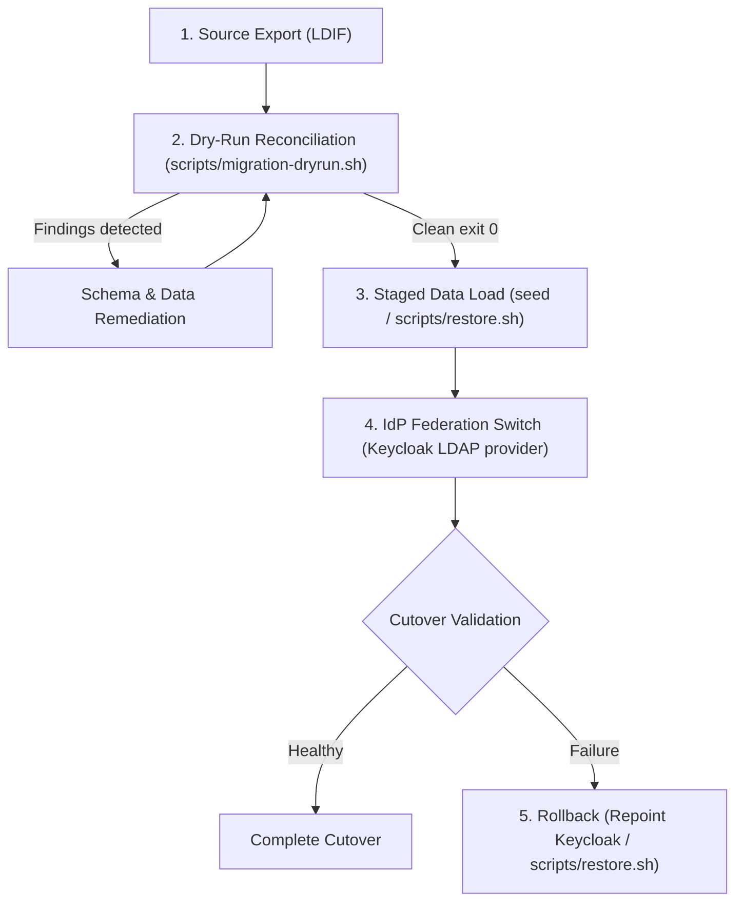

# Migration and Cutover Runbook

This runbook documents the end-to-end migration, staged cutover, and rollback
procedures for migrating identities from external LDAP/AD directories into
ldapium, using only existing repository tooling.

## Product Boundary and Non-Goals (Decision D1)

As defined in [docs/product-boundary.md](product-boundary.md) (Decision D1),
ldapium is a single LDAPv3 directory server. It is not a multi-directory
federation broker, identity synchronization daemon, or Source-of-Authority (SoA)
attribute merge engine.

Specifically, **ldapium does NOT provide**:
- **Dual-write proxies or multi-directory write splitting**: Writes are committed
  solely to ldapium's internal `back-mdb` database.
- **Live synchronization or delta-polling from foreign directories**: ldapium does
  not poll Active Directory, FreeIPA, or external LDAP servers. OpenLDAP's
  `syncrepl` (`olcMultiProvider`) operates strictly between ldapium peer nodes.
- **Automated SCIM or IGA identity reconciliation**: Identity lifecycle management
  and authoritative record reconciliation belong in dedicated IGA or HRIS platforms.
- **Active Directory domain emulation**: ldapium does not support Kerberos domain
  trusts, Group Policy Objects (GPOs), or MS-DRSR replication (see
  [docs/client-compatibility.md](client-compatibility.md)).

Migration into ldapium is supported strictly through **deterministic, batch-based
LDIF validation, offline seeding/restore, and IdP-brokered cutover**.

---

## Staged Migration Procedure



### Stage 1: Assessment and Dry-Run Reconciliation

Before touching any production service, export an LDIF extract from the source
directory and run the offline reconciliation validator:

```bash
./scripts/migration-dryrun.sh <external.ldif> --base-dn dc=example,dc=org -o report.json
```

#### How Dry-Run Operates
- Runs inside a throwaway container of the `ldapium:e2e` image, created with
  `docker create` and explicitly removed on exit (trap), as the non-root `ldap`
  user (uid 999). The input LDIF is never bind-mounted — it is streamed in with
  `docker cp`, sidestepping both the Colima/macOS bind-mount UID mapping gotcha
  (see `AGENTS.md`) and the broader exposure of putting a host path (with
  potentially sensitive LDIF contents) inside a container's mount namespace.
- Starts **no slapd daemon**; writes temporary `cn=config` and database files inside
  the throwaway container, removed cleanly with the container on exit.
- Initializes OpenLDAP's `cn=config` with the exact schemas (`core`, `cosine`,
  `inetorgperson`, `nis`) and overlays (`unique`, `ppolicy`, `memberof`,
  `refint`) loaded by `image/entrypoint.sh`.
- Any failure bootstrapping that `cn=config` (image pull, `docker cp`, or the
  bootstrap `slapadd -n 0`) aborts the dry-run with exit `2` and the raw
  container stderr — it never falls through to a findings report.
- After bootstrap, dumps the schema actually loaded (`slapcat -n 0 -b
  cn=schema,cn=config`) and hands it to `migration-report.py` via
  `--schema-ldif`, so `unknown_object_classes`/`unknown_attributes` are judged
  against the image's real schema, not a hand-maintained list (the static list
  is used only as a fallback, e.g. in the offline unit test, and is marked
  `"schema_source": "static-fallback"` in the report when that happens).
- Executes OpenLDAP `slapadd -u -c` (dry-run, continue-on-error) against the
  provided LDIF to catch schema syntax and structural constraint errors. This
  step's exit status reflects data findings, not bootstrap health, and does not
  by itself fail the script.
  Because OpenLDAP `slapadd` operates directly against database backends and
  bypasses overlays (including `slapo-unique`), `migration-dryrun.sh` evaluates
  uniqueness overlay constraints (`olcUniqueURI`) and base-DN boundaries directly
  during reconciliation, scoped to the same `(objectClass=inetOrgPerson)` filter
  and `--unique-attributes` (default: `${LDAP_UNIQUE_ATTRIBUTES:-uid,mail}`,
  mirroring `image/entrypoint.sh`'s own default) that the real `unique` overlay
  uses in production.
- Generates a deterministic JSON report analyzing:
  - `entry_count_by_objectclass`: Distribution of objectClasses.
  - `unknown_object_classes`: Classes not recognized by ldapium (e.g. AD `user`).
  - `unknown_attributes`: Attributes not in ldapium's schema (e.g. `sAMAccountName`, `objectGUID`).
  - `duplicate_collisions`: Violations of the `unique` overlay constraint, for
    whichever attributes and filter `unique_overlay` in the report states were used.
  - `entries_with_no_structural_object_class`: Entries lacking an RFC 4512 structural class.
  - `entries_outside_base_dn`: Entries with DNs outside the target `--base-dn`.
  - `errors`: Per-entry error messages from `slapadd` or schema evaluation, merged
    with the report's own generated findings (neither list is dropped in favor
    of the other).
  - **Attribute security**: All `userPassword` values (hashes or cleartext) are
    strictly redacted from the output (`***REDACTED***`).
- An unparseable LDIF (no `dn:` records, or lines that are not valid LDIF
  syntax) is itself a fatal finding: the report still lists the parse errors
  but exits `2`, the same as a Docker/bootstrap failure — it is never reported
  as a clean or partial run.

Exit codes:
- `0`: Clean — LDIF complies fully with ldapium schema and constraints.
- `1`: Findings detected — schema, uniqueness, or structural remediation needed.
- `2`: Fatal error — invalid CLI arguments, unreadable file, or Docker failure.

#### Common Remediation Mappings (e.g., from Active Directory)
| Source Attribute / Class | ldapium Standard | Rationale |
|---|---|---|
| `objectClass: user` | `objectClass: inetOrgPerson` | Standard structural person class |
| `sAMAccountName` | `uid` | Primary POSIX/LDAP naming attribute |
| `userPrincipalName` | `mail` | RFC 822 / standard email identifier |
| `objectGUID`, `objectSid` | Dropped / transformed | Microsoft proprietary binary identifiers |
| Duplicate `mail` | Deduplicated per user | Enforced by ldapium `unique` overlay |

---

### Stage 2: Staged Data Loading

Once the dry-run passes cleanly (exit 0):

#### Option A: Initial Deployment Seeding
Mount the sanitized LDIF files into `LDAP_SEED_DIR` (`/opt/ldifs`). In Helm:
```yaml
seed:
  enabled: true
  ldifs:
    01-users.ldif: |
      <reconciled LDIF content>
```
Applied deterministically on first launch before slapd becomes PID 1
(`image/entrypoint.sh`).

#### Option B: Offline Database Loading / Staged Cutover
For existing instances, loading restored backup data requires an offline directory:
```bash
# 1. Scale down directory StatefulSet so slapd is offline (per charts/ldapium/README.md)
kubectl -n directory scale statefulset directory-ldapium --replicas=0

# 2. Run restore.sh against offline storage volumes using a verified backup
./scripts/restore.sh \
  --backup-dir /path/to/backup \
  --target-config /etc/openldap/slapd.d \
  --target-data /var/lib/openldap/data \
  --confirm-offline

# 3. Scale StatefulSet back up
kubectl -n directory scale statefulset directory-ldapium --replicas=1
```
`scripts/restore.sh` restores data and configuration from a verified ldapium backup
manifest, operating strictly offline directly against storage volumes while the pod
is stopped (see `charts/ldapium/README.md`, "Backup / Restore").

---

### Stage 3: SSO Client Reconfiguration Minimization via Keycloak

In modern enterprise architectures, modifying dozens or hundreds of individual
relying-party applications (VPN, Git, CI/CD, internal portals) to point to a new
LDAP server creates massive operational friction and cutover risk.

**The recommended pattern**: Abstract LDAP behind an Identity Provider (Keycloak)
using Keycloak LDAP User Federation.

```
+-------------------------------------------------------------+
|                     Relying Applications                   |
|              (Kubernetes OIDC, Grafana, GitLab)             |
+-------------------------------------------------------------+
                              |
                              | Standard OIDC / SAML Tokens
                              v
+-------------------------------------------------------------+
|                     Keycloak (SSO / IdP)                    |
+-------------------------------------------------------------+
                              |
                              | LDAPv3 User Storage Provider
                              v
            +------------------------------------+
            |  [Before] Legacy Directory (AD)    |
            |  [After]  ldapium                  |
            +------------------------------------+
```

#### Evidence and Verification
This half of the chain — LDAP `member` -> Keycloak group -> token `groups` claim,
including a live LDAP membership change propagating through a re-sync — is
continuously live-verified end to end by `.github/workflows/keycloak-federation-e2e.yml`
with the exact provider settings documented in `charts/ldapium/README.md`'s "Keycloak
LDAP user federation" (matching `docs/client-compatibility.md`):
- Keycloak connects to ldapium as an LDAP user storage provider.
- Keycloak maps ldapium users and groups into standard OIDC token claims (`groups`,
  `preferred_username`, `email`).
- Downstream applications consuming Keycloak OIDC require **zero configuration
  changes** during the migration. Only the single Keycloak LDAP provider URL is
  updated.

---

### Stage 4: Cutover and Downtime Window

1. **Write Freeze Window**: Set the source directory to read-only or restrict
   modifications to freeze state during the cutover window.
2. **Offline Data Seed / Restore**: Apply the sanitized LDIF via first-launch
   seeding (Option A) or restore a verified backup offline into ldapium (Option B)
   during the scheduled maintenance window.
3. **Endpoint Switch**: Update Keycloak User Federation `connectionUrl` (or
   external DNS / Kubernetes Service endpoints) to point to ldapium:
   `ldap://directory-ldapium.directory.svc.cluster.local:389` (or LDAPS on 636).
4. **Cutover Validation & Post-Migration Health**:
   - Validate authentication and group claim propagation through Keycloak.
   - Lift the write freeze once validation succeeds.
   - Write availability during maintenance is measured using the write probe
     methodology from `.github/workflows/upgrade-e2e.yml` (`upgrade-write-probe`).

---

### Stage 5: Rollback Runbook

If critical anomalies occur post-cutover:

1. **Immediate SSO Auth Rollback**:
   - In Keycloak Admin Console (or via `kcadm.sh`), re-enable or repoint the
     User Storage Provider back to the legacy directory endpoint.
   - Applications immediately resume authentication against the original authority.
   - Requires zero client configuration edits.
2. **Directory Storage Rollback**:
   - If ldapium database state must be returned to the pre-migration snapshot,
     execute disaster recovery restore using `scripts/restore.sh`:
     ```bash
     ./scripts/restore.sh \
       --backup-dir /var/backups/ldap-pre-migration \
       --target-config /etc/openldap/slapd.d \
       --target-data /var/lib/openldap/data \
       --confirm-offline \
       --force-empty
     ```
   - Verified continuously in `.github/workflows/backup-restore.yml`.
