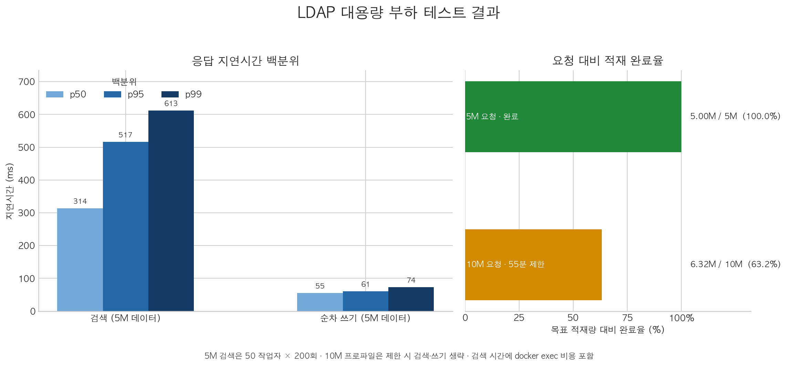

# LDAP 대용량 부하 테스트 결과

- 실행일: 2026-10-01
- 이미지: `ldapium:e2e` (`sha256:3e0de23501db29a03e71e2e49b5a53312c4f82d2c99da531b5ddc2f775381027`)
- OpenLDAP: 2.6.15
- 호스트: Macmini, Docker Desktop, Apple Silicon
- 벤치마크 서버 제한: 3 CPU, 메모리 6 GiB
- 호스트 Docker 한도: 14 CPU, 메모리 64 GiB

## 지연시간과 적재 진척도



## 지연시간 상세 표

| 작업 | 동시성 | 표본 수 | 실패 | 처리량 | p50 | p95 | p99 |
|---|---:|---:|---:|---:|---:|---:|---:|
| 5M 데이터 검색 | 50 작업자 | 10,000 | 0 | 119.40 QPS | 313.705ms | 516.765ms | 612.568ms |
| 5M 데이터 순차 쓰기 | 1 연결 | 200 | 0 | 해당 없음 | 55.308ms | 60.828ms | 73.512ms |

## 결과 요약

| 구간 | 부하 조건 | 결과 | 판정 |
|---|---|---|---|
| 3노드 동시 검색 | 노드당 동시 사용자 10명, 사용자당 검색 200회, 총 6,000 검색 | 오류 0건. 노드별 p50 0ms, p95 1ms, p99 1ms, 최대 2ms | 통과. 데모 데이터 8건으로 소규모 확인 |
| 단일 노드 대용량 적재 | 5,000,000 엔트리, LMDB 맵 12 GiB | 5,000,000건 확인. 408.785초, 초당 12,231건. 실제 할당 DB 6.40 GiB | 통과 |
| 단일 노드 동시 검색 | 5,000,000 엔트리, 동시 작업자 50명 × 200회, 총 10,000 검색 | 오류 0건. 119.40 QPS. p50 313.705ms, p95 516.765ms, p99 612.568ms | 통과. 검색 도구 프로세스 실행 시간 포함 |
| 단일 노드 쓰기 | 순차 LDAP 추가 200회, 연결 1개 | 오류 0건. p50 55.308ms, p95 60.828ms, p99 73.512ms | 통과. 동시 쓰기 시험은 아님 |
| 단일 노드 1천만 적재 시도 | 목표 10,000,000건, LMDB 맵 20 GiB, 적재 제한 55분 | 제한 시점 6,316,999건. 3,307.554초, 실제 할당 DB 8.19 GiB. 검색·쓰기 단계는 실행되지 않음 | 미완료. 1천만 전체 적재 실패 |

## 판단

5백만 엔트리 데이터베이스에서는 적재 검증과 1만 건 검색, 200회 순차 쓰기가 모두 오류 없이 끝났다. 검색 p95는 약 517ms였고, 이 값에는 매 검색마다 `docker exec`와 `ldapsearch` 프로세스를 새로 실행하는 비용이 포함된다. 따라서 원시 LDAP 프로토콜 지연이나 서비스 SLO 수치로 해석하면 안 된다.

이번 실행에는 사전에 합의된 처리량·지연 SLO가 없으므로, 표의 “통과”는 해당 벤치마크 단계가 목표 건수와 오류 0건으로 완료됐다는 뜻이다. 서비스 용량 승인이나 장애 복구 보증을 뜻하지 않는다.

1천만 엔트리 시도는 55분 제한에 걸려 6,316,999건에서 종료됐다. 제한 시점 로그만으로 원인을 특정할 수 없으며, 1천만 용량을 지원한다고 검증된 것으로 간주하지 않는다. 다음 단계는 500만~1천만 사이에서 적재 규모를 좁혀가며 병목을 재측정하는 것이다.

## 토폴로지 범위와 데이터 안전

대용량 5백만·1천만 프로파일은 별도로 생성한 단일 OpenLDAP 컨테이너와 임시 Docker 볼륨에서 수행했다. 실제 3노드 데모 컨테이너의 데이터에는 대용량 적재를 하지 않았다. 테스트 후 임시 볼륨은 벤치마크 스크립트가 삭제했고, 기존 3노드 컨테이너는 계속 `healthy` 상태임을 확인했다.

따라서 이 결과는 **단일 노드의 대용량 적재·검색 및 순차 쓰기**를 검증한다. 5백만 엔트리 데이터를 3노드에 복제한 뒤 수행하는 다중 노드 부하·장애 조치 검증은 아직 아니다. 현재 `kubectl` API 서버 연결이 거부되어 Helm 기반 3노드 대용량 복제 테스트 환경을 띄우지 못했다.

## 재현 명령

성공한 5백만 엔트리 실행:

```sh
./scripts/bench-profile.sh \
  --image ldapium:e2e \
  --entries 5000000 \
  --out .local/ldap-load-results/large-5m \
  --db-max-size-gb 12 \
  --timeout-seconds 3000 \
  --search-concurrency 50 \
  --search-queries-per-worker 200 \
  --write-count 200
```

10M 제한 실행의 원자료는 `.local/ldap-load-results/large-10m/` 아래에, 완료된 5M 결과 JSON/Markdown은 `.local/ldap-load-results/large-5m/` 아래에 있다. `.local/`은 Git에서 제외된다.

그래프는 다음 명령으로 원자료 JSON에서 다시 생성할 수 있다:

```sh
python3 scripts/plot-ldap-load-results.py
```
